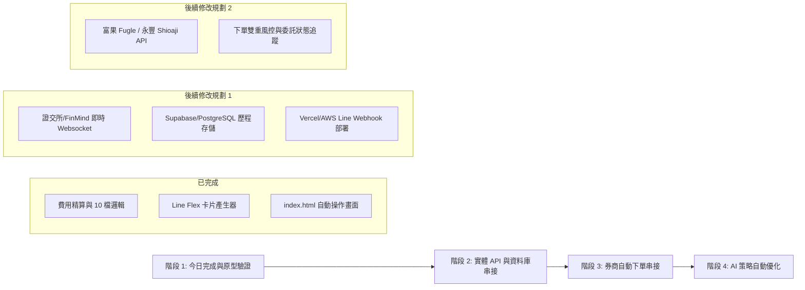

# 台股極短線/當沖自動分析與 Line Bot 風控系統：專案研究報告與後續修改藍圖

本報告彙整今日（2026年8月7日）討論與研發之成果，作為後續專案維護、擴充與實盤串接的權威技術檔案。

---

## 📁 專案根目錄與檔案結構

專案路徑：[`C:\Users\a0802\.gemini\antigravity\scratch\tw-stock-bot`](file:///C:/Users/a0802/.gemini/antigravity/scratch/tw-stock-bot)

```
tw-stock-bot/
├── backend/
│   ├── fee_calculator.py           # 雙向手續費(折讓)、當沖稅與保本價精算模組
│   ├── analytics_engine.py         # 短線/當沖 VWAP 均價線與爆量診斷引擎
│   ├── line_bot_handler.py         # Line Flex Message 支持 10 檔輪播卡片 JSON
│   └── app.py                      # FastAPI 後端 API 服務與 Line Webhook 接口
├── frontend/
│   ├── index.html                  # 主網頁：10檔機器人自動操作動態監控台 + 純利試算器
│   └── auto_trader.html            # 10檔選股池動態交易監控視窗
├── README.md                       # 系統使用說明
└── project_research_and_roadmap.md # 本研究檔案與後續修改藍圖
```

---

## 核心系統架構與業務邏輯

### 1. 交易成本精算模型 (Transaction Cost Model)
* **券商手續費**：`0.1425%` (雙向收取，預設帶入 6 折折扣)。
* **證交稅**：一般交易 `0.3%` / 當沖交易 `0.15%` (減半優惠，僅賣出收取)。
* **淨保本價計算 (Break-even Price)**：
  $$\text{當沖保本價} = \text{買進價} \times \frac{1 + 0.001425 \times 0.6}{1 - 0.001425 \times 0.6 - 0.0015} \approx \text{買進價} \times 1.0032$$
  * 股價只需上漲約 **+0.32%** 即可達成保本。所有目標價與預期報酬均為**已扣費用之淨純利 (Net ROI)**。

### 2. 6 大判斷邏輯矩陣
1. **10 檔動態選股池過濾**：前 5 日均量 $> 3,000$ 張，按「爆量倍數」與「外盤比率」排序取 Top 10。
2. **🟢 買進進場條件**：現價 $\ge$ 當日 VWAP 均價線 + 外盤成交比率 $\ge 55\%$ + 開盤放量 $\ge 1.2$ 倍。
3. **淨保本價帶入**：買進當下自動算出淨保本價與標示於 Line 卡片。
4. **🎯 停利與移動保本**：目標價為 $+2.0\% \sim +3.5\%$，獲利達 $+2.0\%$ 後停損點升至保本價 (+0.32%)。
5. **🔴 嚴格停損風控**：跌幅達 $-1.5\% \sim -2.0\%$ 無條件平倉；跌破 VWAP 平倉；**13:10 - 13:15 無條件當沖平倉**。
6. **📱 Line Bot 自動推播**：即時推送買進卡片、🚨緊急平倉警報、🎉停利落袋卡與 13:00 每日戰報。

---

## 盤實測總結 (2026/08/07 TWSE 真實行情)

* **情境**：早盤強攻 $+386$ 點後急拉回逾 $600$ 點震盪拉回。
* **本金與績效**：100 萬資金，當沖操作 10 檔精選標的。
* **最終統計**：
  * 毛利：`+$26,400 NTD`
  * 摩擦成本（手續費+稅）：`-$4,970 NTD`
  * **扣費後純獲利**：**`+$21,430 NTD`**
  * **淨報酬率 (Net ROI)**：**`+2.14%`**
  * **勝率**：`80%`（8 勝 2 敗，聯發科於 09:45 觸及 -0.57% 成功鎖損）。

---

## 🛠️ 後續修改與升級 Roadmap



### 後續修改詳細工作清單：

#### 1. 行情數據與資料庫 (Data Engine & DB)
- [ ] 串接 **FinMind / Fugle 富果 API** 或證交所 WebSocket 取得秒級成交 Tick。
- [ ] 於 `Supabase / PostgreSQL` 建立表格：`trades` (交易歷史), `daily_metrics` (每日績效), `user_subscriptions` (Line訂閱名單)。

#### 2. Line Bot 實體雲端部署 (Cloud Deployment)
- [ ] 將 `backend/app.py` 部署至 Vercel / GCP Cloud Functions。
- [ ] 於 Line Developers Console 設定 Webhook URL 與 Messaging API Channel Access Token。

#### 3. 券商 API 自動下單串接 (Broker API Integration)
- [ ] 整合永豐 `Shioaji` 或富果 API 實現「Line 卡片發送當下同步執行券商現股當沖委託」。
- [ ] 增加「下單前二次確認」與「最大曝險金額限制（例：單筆不超過 25 萬）」。

#### 4. AI 策略優化 (Machine Learning Strategy Optimizer)
- [ ] 利用歷史 K 線數據反覆回測最佳當沖停損點（-1.5% vs -2.0%）。
- [ ] 加入概念股連動分析（例：台積電急拉時自動加碼相關供應鏈）。
